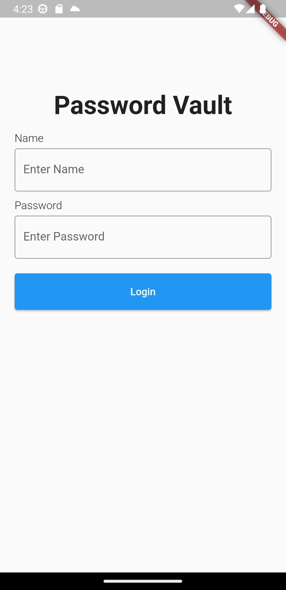
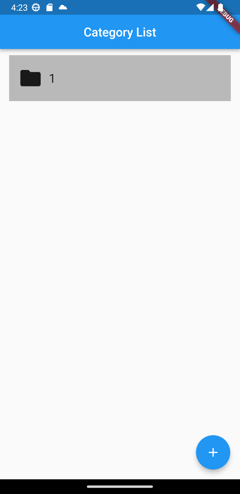
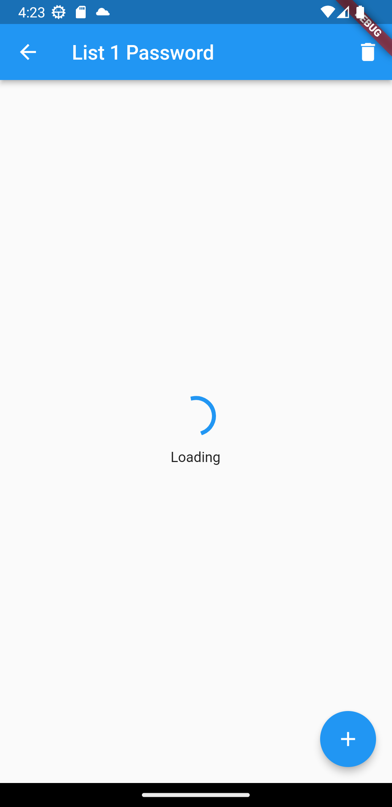
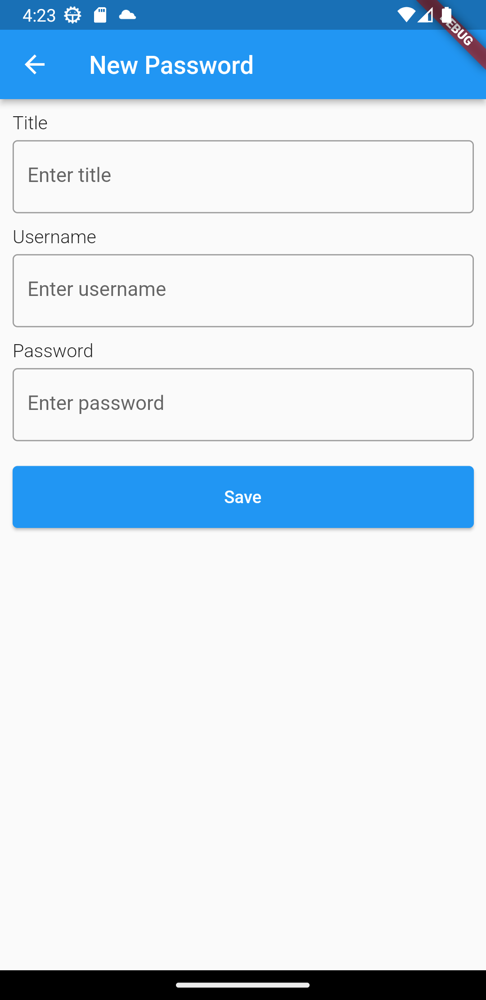

# Flutter Password Vault

## Features

-   Username & Password Authentication (SharedPreferences data)
-   Create category and Create password (store sqlite)
-   Encrypty and Decrypt (Salsa20)
-   Responsive UI

## Screenshots

